# 🛒 E-Commerce Backend — Complete Project Walkthrough

A deep dive into every part of this project, explained simply.

---

## 🏗️ Architecture Overview

This project follows a **layered architecture** — similar to how Express apps are often structured, but more strictly organized:

```mermaid
graph TD
    Client["🌐 Client (React, Mobile, Postman)"]
    Client -->|HTTP Request| Uvicorn["⚡ Uvicorn (web server)"]
    Uvicorn --> CORS["🔒 CORS Middleware"]
    CORS --> Router["📍 Central Router (api/v1/router.py)"]
    Router --> Route["📄 Route (thin HTTP handler)"]
    Route -->|"Depends()"| Auth["🔑 Auth Dependency"]
    Route --> Controller["🧠 Controller (business logic)"]
    Controller --> Model["💾 Model (data access)"]
    Controller --> Tasks["⏳ Celery Tasks (background)"]
    Tasks --> Redis["🗄️ Redis"]
    Model --> DB["🗃️ In-Memory DB (mock)"]
    Route -->|JSON Response| Client
```



### What each layer does

| Layer | Folder | Responsibility | Express Equivalent |
|---|---|---|---|
| **Route** | `api/v1/routes/` | Accept HTTP request, call controller, return response | `routes/` |
| **Controller** | `controllers/` | Business logic, validation, orchestration | `controllers/` |
| **Model** | `models/` | Data access — CRUD operations on the database | `models/` (Mongoose) |
| **Schema** | `schemas/` | Define shape of request/response data + validate | Joi / Zod schemas |
| **Core** | `core/` | App config, auth, logging — shared utilities | `middleware/` + `config/` |
| **Tasks** | `tasks/` | Background jobs (email, payments) | BullMQ workers |
| **Services** | `services/` | External API calls (HTTP clients) | Axios instances |

---

## 📍 Entry Point — What Happens on Startup

When you run `uvicorn app.main:app --reload --port 8000`, here's exactly what happens:


### The key files: `main.py` + `api/v1/router.py`

`main.py` stays slim — it only mounts a single centralized router:

```python
# main.py
from app.api.v1.router import router as v1_router

app = FastAPI(title=settings.app_name, version="1.0.0")
app.add_middleware(CORSMiddleware, allow_origins=settings.allowed_origins, ...)
app.include_router(v1_router)  # ← one line, done
```

All route registration lives in `api/v1/router.py`:

```python
# api/v1/router.py
router = APIRouter(prefix="/api/v1")

router.include_router(auth.router,     prefix="/auth",     tags=["Auth"])
router.include_router(products.router, prefix="/products", tags=["Products"])
router.include_router(orders.router,   prefix="/orders",   tags=["Orders"])
# Add new routers here — main.py never changes
```

> **Why?** As the project grows, you keep adding routes to `router.py` — `main.py` stays the same size forever. It's like having a separate `routes/index.js` in Express instead of piling everything into `app.js`.

---

## 🔑 Authentication — How JWT Works Here

### Example Scenario: User signs up and logs in

**Step 1 — Registration** (`POST /api/v1/auth/register`)

```
Client sends: { "name": "John", "email": "john@mail.com", "password": "secret123" }
```



```mermaid
sequenceDiagram
    participant Client
    participant Route as routes/auth.py
    participant Controller as auth_controller.py
    participant Model as models/user.py
    participant Security as core/security.py

    Client->>Route: POST /api/v1/auth/register
    Note over Route: Schema validates: name≥2 chars, valid email, password≥8 chars
    Route->>Controller: register_user(body)
    Controller->>Model: find_user_by_email("john@mail.com")
    Model-->>Controller: None (not found = good)
    Controller->>Security: hash_password("secret123")
    Security-->>Controller: "$2b$12$xyz..." (bcrypt hash)
    Controller->>Model: create_user(name, email, hashed_password)
    Model-->>Controller: { id: "user_1", name: "John", ... }
    Controller-->>Route: UserResponseSchema
    Route-->>Client: 201 Created { id, name, email, role }
```

> **What's happening:** The plain password `"secret123"` is **never stored**. Only the bcrypt hash `"$2b$12$xyz..."` is saved. This is the same as `bcrypt.hash()` in Node.

---

**Step 2 — Login** (`POST /api/v1/auth/login`)

```
Client sends: { "email": "john@mail.com", "password": "secret123" }
```


> **Two tokens are returned:**
> - **Access token** — short-lived (30 min), used for every API call
> - **Refresh token** — long-lived (7 days), used to get a new access token when the old one expires

---

**Step 3 — Using a protected route** (`GET /api/v1/auth/me`)

```
Client sends: Header → Authorization: Bearer eyJhbGci...
```


> **How `Depends()` works** — It's FastAPI's version of Express middleware. When a route has `current_user = Depends(get_current_user)`, FastAPI automatically:
> 1. Extracts the `Bearer` token from the `Authorization` header
> 2. Runs `get_current_user()` to decode and validate it
> 3. Passes the result as a parameter to your route function
> 4. If validation fails → auto-returns `401 Unauthorized` (your route code never runs)

---

## 🛍️ Product Flow — CRUD with Role-Based Access

### Who can do what?

| Action | Customer | Admin |
|---|---|---|
| List products | ✅ | ✅ |
| Get single product | ✅ | ✅ |
| Create product | ❌ 403 | ✅ |
| Update product | ❌ 403 | ✅ |
| Delete product | ❌ 403 | ✅ |

### How admin-only routes work

```python
# In routes/products.py
@router.post("/")
async def create_product(
    body: CreateProductSchema,
    admin: dict = Depends(require_admin),  # ← This is the guard
):
    return await product_controller.create_product(body, admin)
```

The `Depends(require_admin)` chain works like this:

```mermaid
graph LR
    A["Request comes in"] --> B["get_current_user()"]
    B -->|"Extracts token,<br>decodes JWT"| C["require_admin()"]
    C -->|"Checks role == admin"| D{"Is admin?"}
    D -->|Yes| E["✅ Run route handler"]
    D -->|No| F["❌ 403 Forbidden"]
    B -->|"No/bad token"| G["❌ 401 Unauthorized"]
```



> Think of it like middleware chaining in Express: `router.post("/", isAuthenticated, isAdmin, createProduct)` — but here the chain is built with `Depends()`.

---

## 📦 Order Flow — The Most Complex Feature

### Example: Customer places an order

```
POST /api/v1/orders/
{
  "items": [
    { "product_id": "prod_1", "quantity": 2, "price": 29.99 },
    { "product_id": "prod_3", "quantity": 1, "price": 49.99 }
  ],
  "shipping_address": {
    "full_name": "John Doe",
    "address_line1": "123 Main St",
    "city": "Mumbai",
    "state": "MH",
    "postal_code": "400001",
    "country": "IN"
  },
  "payment_method": "stripe"
}
```



```mermaid
sequenceDiagram
    participant Client
    participant Route as routes/orders.py
    participant Auth as Depends(get_current_user)
    participant Controller as order_controller.py
    participant Model as models/order.py
    participant Celery as Celery Worker
    participant Stripe as Stripe API
    participant Email as Email Service

    Client->>Route: POST /api/v1/orders + Bearer token
    Route->>Auth: Validate JWT token
    Auth-->>Route: { user_id: "user_1", role: "customer" }
    Route->>Controller: create_order(body, current_user)
    
    Note over Controller: Calculate total: (29.99×2) + (49.99×1) = $109.97
    
    Controller->>Model: create_order(user_id, items, address, total, ...)
    Model-->>Controller: { id: "order_1", status: "pending", ... }
    
    Note over Controller: Fire background tasks (non-blocking)
    Controller->>Celery: process_payment.delay("order_1", 109.97, "stripe")
    Controller->>Celery: send_order_confirmation_email.delay("user_1", "order_1")
    
    Controller-->>Client: 201 Created { order details }
    
    Note over Client,Email: Meanwhile, in the background...
    Celery->>Stripe: Charge $109.97
    Celery->>Email: Send confirmation email
```

> **Key concept:** The API responds to the client **immediately** with the order details. The payment processing and email sending happen **in the background** via Celery workers. The client doesn't wait for Stripe or email to finish. This is the same pattern as BullMQ in Node.

---

## 📋 Schema Validation — The Gatekeeper

Schemas automatically validate every incoming request **before your code runs**. If validation fails, FastAPI returns `422 Unprocessable Entity` with details.

### Example: What happens with bad data

```
POST /api/v1/auth/register
{ "name": "J", "email": "not-an-email", "password": "123" }
```

**Result:** `422` error — your controller code never executes.

```json
{
  "detail": [
    { "loc": ["body", "name"], "msg": "ensure this value has at least 2 characters" },
    { "loc": ["body", "email"], "msg": "value is not a valid email address" },
    { "loc": ["body", "password"], "msg": "ensure this value has at least 8 characters" }
  ]
}
```

### How schemas map to what you know

| Schema rule | Express/Joi equivalent |
|---|---|
| `name: str = Field(..., min_length=2)` | `Joi.string().min(2).required()` |
| `email: EmailStr` | `Joi.string().email()` |
| `price: float = Field(..., gt=0)` | `Joi.number().positive().required()` |
| `stock: int = Field(..., ge=0)` | `Joi.number().integer().min(0)` |
| `category: CategoryEnum` | `Joi.string().valid("electronics", "clothing", ...)` |
| `images: List[str] = []` | `Joi.array().items(Joi.string()).default([])` |

---

## ⏳ Background Tasks — Celery + Redis

### How it works (simplified)


**Two processes run separately:**
1. **FastAPI** (your API server) — handles HTTP requests
2. **Celery worker** (runs in a separate terminal) — processes background jobs

### Example: What `.delay()` does

```python
# This does NOT call the function right now
# It puts a message in Redis saying "run this later"
process_payment.delay("order_1", 109.97, "stripe")
#                     ^^^^^^^^^^^^^^^^^^^^^^^^^^^^^^^^
#                     These args are serialized to JSON
#                     and stored in Redis
```

The Celery worker is constantly watching Redis. When it sees a new task, it picks it up and runs it. If it fails, it retries up to 3 times.

---

## 🗄️ Configuration — How `.env` Works


The `Settings` class in `core/config.py` maps `.env` variables to Python attributes:

```
.env file:                          Python code:
SECRET_KEY=abc123           →       settings.secret_key  # "abc123"
REDIS_URL=redis://...       →       settings.redis_url   # "redis://..."
ACCESS_TOKEN_EXPIRE_MINUTES=30  →   settings.access_token_expire_minutes  # 30
```

> **Automatic type conversion:** If you set `ACCESS_TOKEN_EXPIRE_MINUTES=30` in `.env` (a string), Pydantic automatically converts it to `int` because the class defines it as `access_token_expire_minutes: int = 30`.

---

## 📊 Logging — What Gets Logged and Where


| Log file | What goes in | Format | Rotation |
|---|---|---|---|
| **Console** | Everything (DEBUG in dev, INFO in prod) | Colored text | — |
| `logs/app.log` | INFO and above | Text | 10 MB, keep 10 days |
| `logs/error.log` | ERROR only | Text | 10 MB, keep 30 days |
| `logs/structured.json` | INFO and above | JSON (for Datadog/CloudWatch) | 10 MB, keep 10 days |

---

## 🔄 Caching — How Redis Cache Works (optional)

Redis caching is **optional**. If Redis is not configured (`REDIS_URL` is empty), the app works normally without caching — every request hits the controller directly.

When Redis IS available, product listing and detail pages are cached:

```python
@router.get("/")
@optional_cache(expire=60)        # ← cached for 60 seconds (skipped if no Redis)
async def get_products():
    ...

@router.get("/{product_id}")
@optional_cache(expire=120)       # ← cached for 120 seconds (skipped if no Redis)
async def get_product():
    ...
```

### What happens on a request (with Redis enabled)

```mermaid
sequenceDiagram
    participant Client
    participant FastAPI
    participant Redis
    participant Controller

    Client->>FastAPI: GET /api/v1/products
    FastAPI->>Redis: Check cache key "ecom-cache:..."
    
    alt Cache HIT (within 60s)
        Redis-->>FastAPI: Cached JSON response
        FastAPI-->>Client: ⚡ Instant response (no controller code runs)
    else Cache MISS (expired or first time)
        Redis-->>FastAPI: Nothing found
        FastAPI->>Controller: list_products(...)
        Controller-->>FastAPI: Fresh data
        FastAPI->>Redis: Store result with 60s TTL
        FastAPI-->>Client: Fresh response
    end
```



> **Without Redis:** The diagram simplifies to just `Client → FastAPI → Controller → Client`. No caching layer involved.

---

## 🧩 Barrel Exports — The Import System

Instead of reaching into deep file paths, every package re-exports its contents from `__init__.py`:

```
Without barrel exports (messy):          With barrel exports (clean):
─────────────────────────────           ──────────────────────────────
from app.schemas.auth import ...        from app.schemas import ...
from app.schemas.products import ...    from app.schemas import ...
from app.core.security import ...       from app.core import ...
from app.core.config import ...         from app.core import ...
from app.models.user import ...         from app.models import ...
from app.models.product import ...      from app.models import ...
```

**One rule:** Files **inside** a package (like `core/security.py`) still import from sibling files directly (e.g., `from app.core.config import settings`) to avoid circular imports. Only **consumer files outside the package** use barrel imports.

---

## 📂 File-by-File Summary

| File | Lines | What it does |
|---|---|---|
| `main.py` | 54 | App creation, middleware, mounts v1_router, startup/shutdown |
| `api/v1/router.py` | 11 | Central router registry — all route registrations in one place |
| `core/config.py` | 37 | Reads `.env`, defines all config as typed Python attributes |
| `core/security.py` | 69 | Password hashing, JWT create/decode, auth dependencies |
| `core/logging.py` | 51 | Loguru setup: console + 3 log files |
| `schemas/auth.py` | 30 | Register, Login, Token, User response shapes |
| `schemas/products.py` | 50 | Product create/update/response + category enum |
| `schemas/orders.py` | 48 | Order items, shipping address, status enum |
| `models/user.py` | 36 | In-memory user store + create/find helpers |
| `models/product.py` | 57 | In-memory product store + full CRUD + filtering |
| `models/order.py` | 49 | In-memory order store + create/find/update |
| `controllers/auth_controller.py` | 55 | Register, login, refresh, profile logic |
| `controllers/product_controller.py` | 61 | Product CRUD logic |
| `controllers/order_controller.py` | 61 | Order creation + background task dispatch |
| `routes/auth.py` | 28 | 4 thin auth endpoints |
| `routes/products.py` | 51 | 5 thin product endpoints (2 cached) |
| `routes/orders.py` | 35 | 4 thin order endpoints |
| `tasks/celery_app.py` | 24 | Celery config (Redis as broker) |
| `tasks/email.py` | 40 | Email tasks with retry logic |
| `tasks/payment.py` | 45 | Payment tasks with retry logic |
| `services/http_client.py` | 52 | Reusable async HTTP client for external APIs |

---

## 🔧 Tech Stack Summary

| What | Library | Node Equivalent |
|---|---|---|
| Web framework | **FastAPI** | Express.js |
| Web server | **Uvicorn** | Node's built-in HTTP server |
| Production server | **Gunicorn** | PM2 |
| Validation | **Pydantic** | Joi / Zod |
| Config/env | **pydantic-settings** | dotenv + process.env |
| Auth (JWT) | **python-jose** | jsonwebtoken |
| Auth (password) | **passlib + bcrypt** | bcrypt |
| Caching | **fastapi-cache2 + Redis** | ioredis / node-cache |
| Task queue | **Celery + Redis** | BullMQ + Redis |
| HTTP client | **httpx** | axios |
| Logging | **Loguru** | winston / pino |
| AWS SDK | **boto3** | aws-sdk |
| Payments | **stripe** | stripe |
| Linter | **Ruff** | ESLint |
| Formatter | **Ruff** | Prettier |
| Type checker | **Mypy** | TypeScript tsc |
| Security scanner | **Bandit** | npm audit |
| Dependency scanner | **Safety** | Snyk |
| Git hooks | **Pre-commit** | Husky |

---

## 🔒 Security & Code Quality Workflow

This project includes comprehensive security scanning and automated code quality enforcement, similar to ESLint + Husky in JavaScript projects.

### **Security Tools**

#### **Bandit - Code Security Scanner**
```bash
# Scan your code for vulnerabilities
bandit -r app/

# Generate JSON report
bandit -r app/ -f json -o security_report.json

# What it finds:
- SQL injection vulnerabilities
- Hardcoded passwords/secrets
- Unsafe deserialization
- Command injection risks
- Insecure cryptographic usage
- Directory traversal vulnerabilities
```

#### **Safety - Dependency Scanner**
```bash
# Check dependencies for known CVEs
safety check

# Generate JSON report
safety check --json --output safety_deps.json

# What it finds:
- Outdated packages with security vulnerabilities
- Known CVEs in your dependencies
- Recommended secure versions
```

### **Pre-commit Hooks**

Automated quality checks that run before every commit:

```yaml
# .pre-commit-config.yaml
repos:
  - repo: https://github.com/astral-sh/ruff-pre-commit
    hooks:
      - id: ruff          # Lint + auto-fix
      - id: ruff-format   # Format code

  - repo: https://github.com/pre-commit/mirrors-mypy
    hooks:
      - id: mypy          # Type checking

  - repo: https://github.com/PyCQA/bandit
    hooks:
      - id: bandit        # Security scanning

  - repo: local
    hooks:
      - id: safety        # Dependency scanning
```

### **Daily Development Workflow**

```bash
# Initial setup (one time)
make pre-commit-setup

# Before committing
git add .
git commit -m "your message"
# → Pre-commit hooks automatically run:
#   1. Ruff linting + formatting
#   2. MyPy type checking
#   3. Bandit security scanning
#   4. Safety dependency checking

# Manual security check
make security

# Full quality check
make quality-check  # lint + format + security
```

### **What This Prevents**

- **Security issues** before they reach production
- **Code quality issues** (formatting, lint errors)
- **Type errors** with static checking
- **Vulnerable dependencies** in your supply chain
- **Inconsistent code style** across the team

This setup ensures your code is secure, well-formatted, and type-safe before every commit - automatically!
